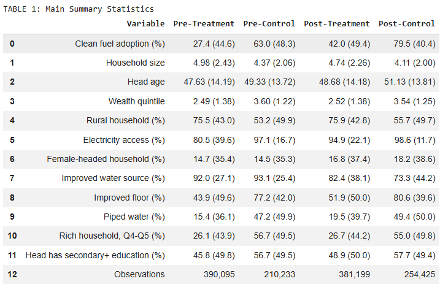
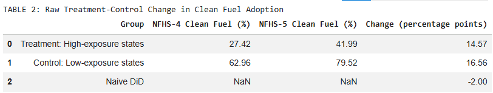
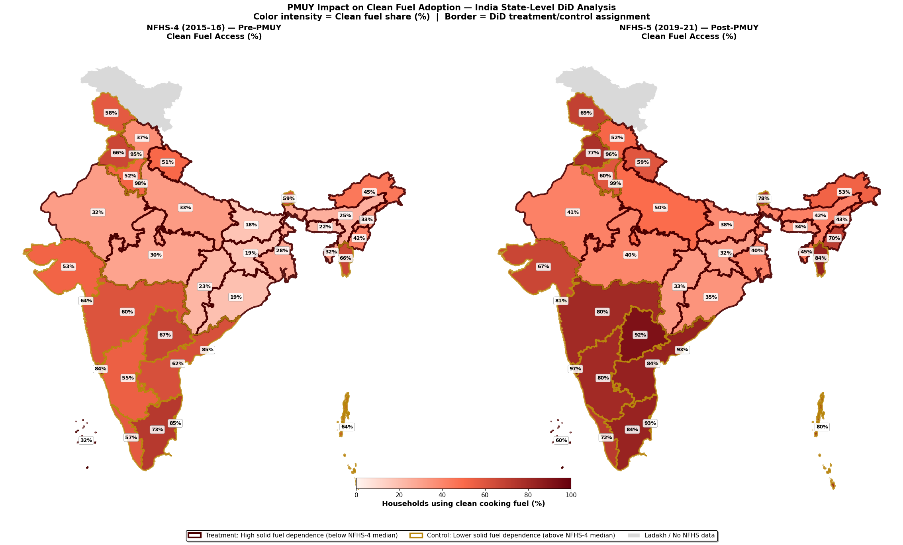
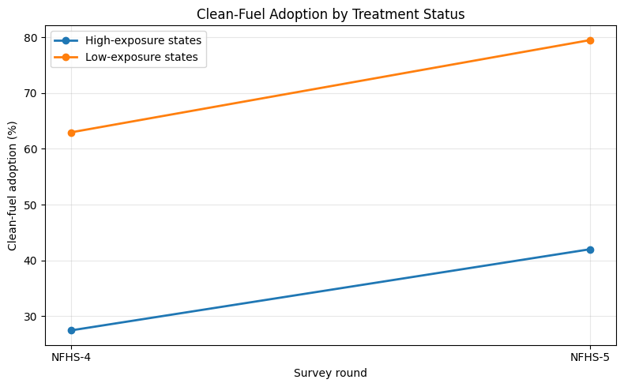

# Final Report

# 1. Introduction

The Pradhan Mantri Ujjwala Yojana (PMUY), launched in 2016, is one of India’s largest clean energy welfare programmes aimed at expanding LPG access among low-income households. The scheme subsidises LPG connections for women from poor households in order to reduce dependence on traditional biomass fuels such as firewood, dung cakes, and crop residue. Reliance on these fuels generates high levels of indoor air pollution and is associated with adverse respiratory and health outcomes, particularly for women and children who are more exposed to household cooking smoke. Since clean cooking fuel adoption was highly uneven across Indian states before PMUY, evaluating whether the programme benefited low-access states more strongly is important for understanding its effectiveness and informing future subsidy expansion decisions.

This project asks: Did states with lower pre-PMUY clean-fuel access experience significantly different changes in clean cooking fuel adoption after the introduction of PMUY relative to states with higher initial clean-fuel access? Using household-level data from NFHS-4 (2015–16) and NFHS-5 (2019–21), the analysis applies a Difference-in-Differences framework to compare changes in clean-fuel adoption between high-exposure and low-exposure states over time.

# 2. Charter Summary

| Field | Summary |
|---|---|
| Project type | Causal inference project using a Difference-in-Differences design |
| Main metric | Difference-in-Differences coefficient on Post×HighExposure measuring changes in clean cooking fuel adoption |
| Success threshold | DiD coefficient with a 95% confidence interval excluding zero and an absolute magnitude of at least 2.0 percentage points |
| Baseline | Naïve Difference-in-Differences estimate of −2.0 percentage points based on unadjusted pre-post state-level averages |

# 3. Data

The analysis combines multiple publicly available datasets to construct a state-level policy evaluation framework.

## Primary Dataset: NFHS Household Microdata

The main source is pooled household-level data from the National Family Health Survey (NFHS), specifically:

- NFHS-4 (2015–16), representing the pre-policy period
- NFHS-5 (2019–21), representing the post-policy period

These surveys were accessed through the DHS Program official website under the DHS data use agreement for non-commercial research purposes. The combined dataset contains over 1.2 million household observations across all Indian states and union territories.

The primary outcome variable is a binary indicator of clean cooking fuel adoption constructed using the household cooking fuel variable (`hv226`). Households using LPG, natural gas, electricity, or biogas are coded as clean-fuel users, while households reporting traditional solid fuels are coded as non-users.

Additional household-level covariates include:

- Rural/urban residence
- Electricity access
- Sex and age of household head
- Household size
- Wealth quintile
- Education level of household head
- Religion and caste identifiers

## Data Storage and Reproducibility

All cleaned and compressed datasets required for replication were stored in the project GitHub repository under the `data/` directory. The primary processed file used in the analysis is:

[pmuy_data_compressed.csv.gz](data/pmuy_data_compressed.csv.gz)

This file contains the pooled and cleaned NFHS household dataset with constructed treatment, post-policy, and outcome variables used in the final analysis pipeline.

# 4. Method

The analysis begins with a descriptive baseline comparison between treatment states (states below the NFHS-4 median clean-fuel share) and control states (states above the median). Weighted household averages from NFHS-4 and NFHS-5 are used to calculate pre-post changes in clean cooking fuel adoption for both groups. This produces a naïve Difference-in-Differences (DiD) estimate that captures the raw change in adoption before adjusting for household characteristics or state-level differences. Additional descriptive analysis examines variation in clean-fuel adoption across states, rural and urban households, and wealth quintiles in order to understand the socioeconomic patterns associated with clean energy access.

The main analysis uses a two-way fixed effects Difference-in-Differences framework to estimate whether high-exposure states experienced different post-PMUY changes in clean-fuel adoption relative to low-exposure states.

$$
Y_{st} = \alpha + \beta_1 Post_t + \beta_2 HighExposure_s + \beta_3 (Post_t \times HighExposure_s) + \delta_s + \lambda_t + \theta_s(Post_t) + \gamma X_{st} + \varepsilon_{st}
$$

where:

- $Y_{st}$ is a binary indicator for clean cooking fuel adoption for household $i$ in state $s$ and period $t$.
- $Post_t$ equals 1 for NFHS-5 (post-PMUY period) and 0 for NFHS-4 (pre-PMUY period), capturing the average post-policy change across all states.
- $HighExposure_s$ identifies states with below-median baseline clean-fuel adoption in NFHS-4.
- $(Post_t \times HighExposure_s)$ is the interaction term and the main Difference-in-Differences estimator.
- $\beta_3$ measures whether high-exposure states experienced a significantly different change in clean-fuel adoption after PMUY relative to low-exposure states.
- $\delta_s$ represents state fixed effects that control for time-invariant differences across states.
- $\lambda_t$ represents time fixed effects that capture nationwide changes between NFHS-4 and NFHS-5.
- $\theta_s(Post_t)$ represents state-specific time trends, implemented through interactions between state fixed effects and the post-policy indicator (`C(state):post`). These terms allow states to follow different underlying trends over time and help account for differential pre-trends across states.
- $X_{st}$ is a vector of household-level control variables including rural residence, electricity access, wealth quintile, household size, education of household head, and housing quality indicators.
- $\varepsilon_{st}$ is the error term.

The model includes state fixed effects, state-specific time trends, and household-level controls including rural residence, electricity access, wealth quintile, household size, education of the household head, and housing quality indicators. Standard errors are clustered at the state level. The causal interpretation relies on the parallel trends assumption, meaning treatment and control states would have followed similar adoption trends in the absence of PMUY.

# 5. Descriptive Statistics

This section presents the main descriptive patterns in the data before estimating the Difference-in-Differences model. The objective is to examine how clean-fuel adoption varied across states, socioeconomic groups, and rural–urban areas before and after the implementation of PMUY.

## Summary Statistics by Treatment Status

Table 1 compares household characteristics across treatment and control states before and after PMUY implementation. Even before the policy rollout, high-exposure states had substantially lower clean-fuel adoption rates than low-exposure states (27.4% versus 63.0%). These states also had lower electricity access, lower wealth levels, poorer housing conditions, and a much larger rural population share. The descriptive patterns confirm that treatment states were systematically more disadvantaged and more dependent on traditional fuels before PMUY, providing a strong policy rationale for targeted intervention.

Between NFHS-4 and NFHS-5, clean-fuel adoption increased in both groups. However, the increase was larger in low-exposure states than in high-exposure states, suggesting that existing regional inequalities in clean-fuel access may have persisted even after the programme expansion. These differences motivate the use of the DiD framework to determine whether the observed trends remain after controlling for household and state-level characteristics.

## Raw Treatment-Control Change

Table 2 presents the unadjusted change in clean-fuel adoption across treatment and control states. High-exposure states experienced an increase from 27.4% to 42.0%, representing a gain of 14.6 percentage points. In contrast, low-exposure states increased from 63.0% to 79.5%, a gain of 16.6 percentage points. The resulting naïve DiD estimate is −2.0 percentage points, indicating that high-exposure states improved more slowly than low-exposure states in raw terms.

Although this estimate is purely descriptive and does not account for covariates or fixed effects, it provides an important benchmark for the later regression analysis. The negative raw DiD suggests that PMUY may not have fully closed the gap between low-access and high-access states during the study period.

## Baseline State Classification and Geographic Distribution

Figure 1 maps state-level clean-fuel adoption rates before and after PMUY implementation and illustrates the treatment classification used in the analysis. States below the NFHS-4 median clean-fuel adoption rate of 52.3% are classified as high-exposure states. These include Bihar, Jharkhand, Odisha, Chhattisgarh, Assam, and several northeastern states, all of which exhibited relatively low clean-fuel access before the policy rollout.

The figure highlights substantial geographic heterogeneity in baseline clean-fuel adoption across India. Southern and urbanized states such as Delhi, Chandigarh, Goa, Tamil Nadu, and Puducherry reported very high pre-policy adoption rates, while several northern and eastern states remained heavily dependent on solid fuels. Although adoption improved across most states by NFHS-5, the regional disparity in clean cooking access remained visible, supporting the importance of evaluating heterogeneous programme impacts.

## Treatment-Control Trend Comparison

Figure 2 plots average clean-fuel adoption over time for treatment and control states. Both groups experienced increases in adoption between NFHS-4 and NFHS-5, but high-exposure states consistently remained far below low-exposure states in overall adoption levels. The figure visually demonstrates the large initial disparity between the two groups and motivates the central DiD question of whether the post-policy trajectory differed systematically across them.

The trend comparison also shows that improvements in high-exposure states did not fully catch up with gains observed in low-exposure states. This visual evidence is consistent with the negative naïve DiD estimate reported earlier.

## 9. Limits

This project can say with reasonable confidence that clean-fuel adoption increased substantially across India between NFHS-4 and NFHS-5, and that the pattern of adoption differed systematically between historically low-access states and states with higher baseline clean-fuel penetration. The analysis also provides evidence that, after controlling for household characteristics, state fixed effects, and state-specific trends, high-exposure states experienced relatively smaller gains in clean-fuel adoption during the post-PMUY period.

However, the project cannot claim fully causal identification with complete confidence. The main limitation is that the parallel trends assumption underlying the Difference-in-Differences framework is not fully satisfied in the raw pre-policy data. Using NFHS-2, NFHS-3, and NFHS-4, treatment and control states exhibit somewhat different trajectories in clean-fuel adoption prior to PMUY implementation. To partially address this issue, the main specification includes state-specific linear time trends, allowing each state to follow its own underlying trajectory over time. While this adjustment helps account for differential pre-existing trends, it also makes the estimated treatment effect more dependent on modeling assumptions regarding how state-level trends evolve over time. Consequently, the estimates should be interpreted cautiously rather than as definitive causal effects.

In addition, the analysis relies on repeated cross-sectional household surveys rather than a true household panel. This means the same households are not tracked over time, limiting the ability to study household-level transitions into clean-fuel adoption.

The treatment classification is also based on baseline state-level clean-fuel penetration rather than direct household-level PMUY participation. As a result, the estimates capture differential state-level adoption patterns associated with PMUY exposure intensity rather than the exact effect of receiving an LPG connection.

Further, the dataset measures whether households report using clean cooking fuel as their primary fuel source, but it cannot observe refill intensity, sustained LPG usage, fuel stacking behavior, or actual fuel consumption volumes. Some households may have obtained LPG connections while continuing to rely partly on traditional biomass fuels.

Finally, although the regressions include extensive household controls and fixed effects, other time-varying factors — such as electrification programs, infrastructure improvements, fuel-price changes, or broader economic growth — may still influence clean-fuel adoption alongside PMUY.

## 10. If The Result Was Null Or Weak

The final regression estimates do not support the initial expectation that high-exposure states experienced faster clean-fuel adoption after PMUY relative to low-exposure states. Instead, the estimated Difference-in-Differences coefficient is negative and statistically significant, suggesting that states with historically low clean-fuel access experienced smaller relative improvements during the post-policy period after controlling for household characteristics, state fixed effects, and state-specific trends.

This finding does not necessarily imply that PMUY failed to increase clean-fuel adoption. Clean-fuel usage increased substantially across both treatment and control states over time. However, the results suggest that historically disadvantaged states may have continued to face structural barriers — including weaker infrastructure, refill affordability constraints, distribution challenges, and lower baseline household capacity to sustain LPG usage — which limited the relative pace of transition toward clean cooking fuels.

The inclusion of state-specific linear time trends is particularly important in interpreting the results. Since the raw pre-policy trends are not perfectly parallel, the adjusted estimates rely partly on assumptions regarding how states would have evolved in the absence of PMUY. Consequently, the findings should be interpreted as evidence of differential state-level adoption patterns conditional on those trend adjustments, rather than as definitive proof of a fully causal policy effect.

More broadly, the project highlights that large-scale welfare programs may generate heterogeneous outcomes across regions depending on baseline conditions and structural constraints. Even when a policy substantially expands access nationally, historically disadvantaged regions may continue to lag behind in relative terms.

## 9. Reproducibility

- Run command:`uv run main.py` (or `python main.py` with dependencies installed)
- Runtime:< 2 minutes on any machine
- Output files written:-
  -`outputs/primary_metric.json`
  - `outputs/baseline_metric.json`
  - `outputs/milestone_manifest.json`

# 10. AI Usage

AI tools were used in a limited supporting role during the project, mainly for resolving minor coding issues, understanding parts of the GitHub workflow, and checking implementation approaches during data cleaning and output generation. The core research design, treatment definition, variable construction decisions, empirical strategy, interpretation, and final analysis were developed and verified by the team.

All AI-assisted suggestions were manually reviewed before use.

A detailed record of AI-assisted tasks and manual verification steps is provided in [AI_USAGE_LOG.md](./AI_USAGE_LOG.md).
