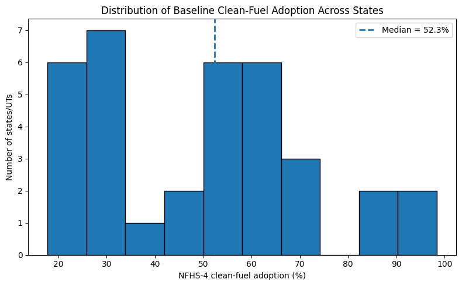
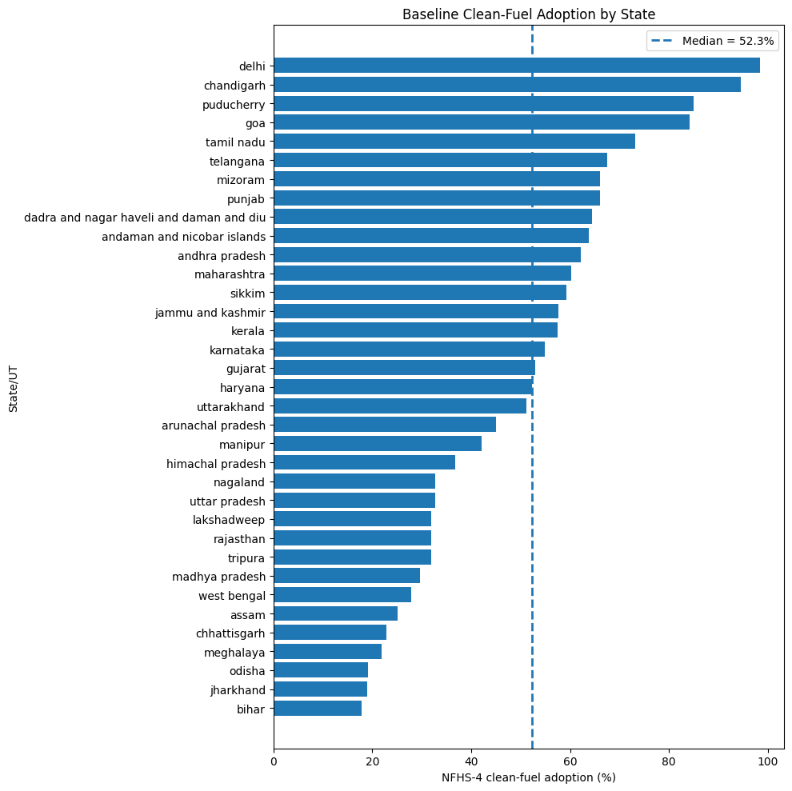
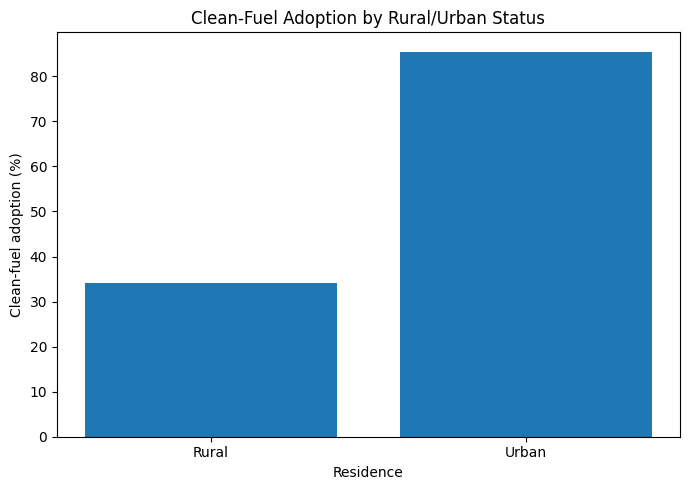
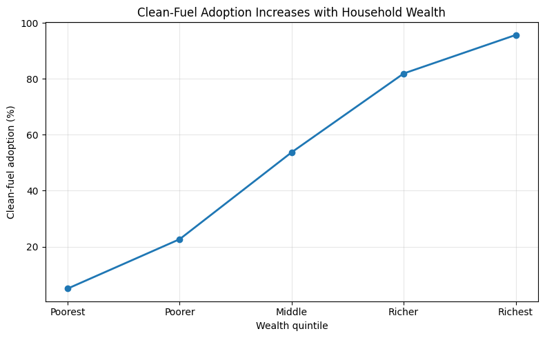
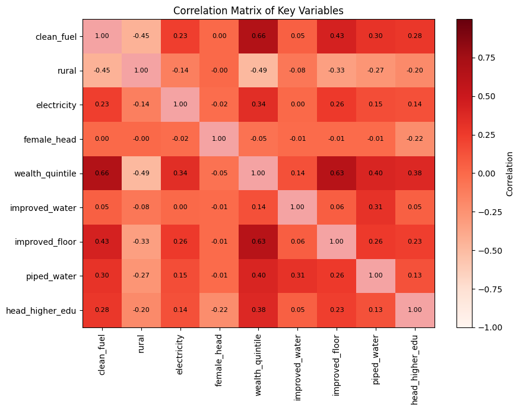

# Final Report

# 1. Introduction

The Pradhan Mantri Ujjwala Yojana (PMUY), launched in 2016, is one of India’s largest clean energy welfare programmes aimed at expanding LPG access among low-income households. The scheme subsidises LPG connections for women from poor households in order to reduce dependence on traditional biomass fuels such as firewood, dung cakes, and crop residue. Reliance on these fuels generates high levels of indoor air pollution and is associated with adverse respiratory and health outcomes, particularly for women and children who are more exposed to household cooking smoke. Since clean cooking fuel adoption was highly uneven across Indian states before PMUY, evaluating whether the programme benefited low-access states more strongly is important for understanding its effectiveness and informing future subsidy expansion decisions.

This project asks: Did states with lower pre-PMUY clean-fuel access experience significantly different changes in clean cooking fuel adoption after the introduction of PMUY relative to states with higher initial clean-fuel access? Using household-level data from NFHS-4 (2015–16) and NFHS-5 (2019–21), the analysis applies a Difference-in-Differences framework to compare changes in clean-fuel adoption between high-exposure and low-exposure states over time.

# 2. Charter Summary

| Field | Summary |
|---|---|
| Project type | Causal inference project using a Difference-in-Differences design |
| Main metric | Difference-in-Differences coefficient on Post×HighExposure measuring changes in clean cooking fuel adoption |
| Success threshold | DiD coefficient with a 95% confidence interval excluding zero and an absolute magnitude of at least 2.0 percentage points |
| Baseline | Naïve Difference-in-Differences estimate of −2.0 percentage points based on unadjusted pre-post state-level averages |

# 3. Data

The analysis combines multiple publicly available datasets to construct a state-level policy evaluation framework.

## Primary Dataset: NFHS Household Microdata

The main source is pooled household-level data from the National Family Health Survey (NFHS), specifically:

- NFHS-4 (2015–16), representing the pre-policy period
- NFHS-5 (2019–21), representing the post-policy period

These surveys were accessed through the DHS Program official website under the DHS data use agreement for non-commercial research purposes. The combined dataset contains over 1.2 million household observations across all Indian states and union territories.

The primary outcome variable is a binary indicator of clean cooking fuel adoption constructed using the household cooking fuel variable (`hv226`). Households using LPG, natural gas, electricity, or biogas are coded as clean-fuel users, while households reporting traditional solid fuels are coded as non-users.

Additional household-level covariates include:

- Rural/urban residence
- Electricity access
- Sex and age of household head
- Household size
- Wealth quintile
- Education level of household head
- Religion and caste identifiers

## Data Storage and Reproducibility

All cleaned and compressed datasets required for replication were stored in the project GitHub repository under the `data/` directory. The primary processed file used in the analysis is:

[pmuy_data_compressed.csv.gz](data/pmuy_data_compressed.csv.gz)

This file contains the pooled and cleaned NFHS household dataset with constructed treatment, post-policy, and outcome variables used in the final analysis pipeline.

# 4. Method

The analysis begins with a descriptive baseline comparison between treatment states (states below the NFHS-4 median clean-fuel share) and control states (states above the median). Weighted household averages from NFHS-4 and NFHS-5 are used to calculate pre-post changes in clean cooking fuel adoption for both groups. This produces a naïve Difference-in-Differences (DiD) estimate that captures the raw change in adoption before adjusting for household characteristics or state-level differences. Additional descriptive analysis examines variation in clean-fuel adoption across states, rural and urban households, and wealth quintiles in order to understand the socioeconomic patterns associated with clean energy access.

The main analysis uses a two-way fixed effects Difference-in-Differences framework to estimate whether high-exposure states experienced different post-PMUY changes in clean-fuel adoption relative to low-exposure states.

$$
Y_{st} = \alpha + \beta_1 Post_t + \beta_2 HighExposure_s + \beta_3 (Post_t \times HighExposure_s) + \delta_s + \lambda_t + \theta_s(Post_t) + \gamma X_{st} + \varepsilon_{st}
$$

where:

- $Y_{st}$ is a binary indicator for clean cooking fuel adoption for household $i$ in state $s$ and period $t$.
- $Post_t$ equals 1 for NFHS-5 (post-PMUY period) and 0 for NFHS-4 (pre-PMUY period), capturing the average post-policy change across all states.
- $HighExposure_s$ identifies states with below-median baseline clean-fuel adoption in NFHS-4.
- $(Post_t \times HighExposure_s)$ is the interaction term and the main Difference-in-Differences estimator.
- $\beta_3$ measures whether high-exposure states experienced a significantly different change in clean-fuel adoption after PMUY relative to low-exposure states.
- $\delta_s$ represents state fixed effects that control for time-invariant differences across states.
- $\lambda_t$ represents time fixed effects that capture nationwide changes between NFHS-4 and NFHS-5.
- $\theta_s(Post_t)$ represents state-specific time trends, implemented through interactions between state fixed effects and the post-policy indicator (`C(state):post`). These terms allow states to follow different underlying trends over time and help account for differential pre-trends across states.
- $X_{st}$ is a vector of household-level control variables including rural residence, electricity access, wealth quintile, household size, education of household head, and housing quality indicators.
- $\varepsilon_{st}$ is the error term.

The model includes state fixed effects, state-specific time trends, and household-level controls including rural residence, electricity access, wealth quintile, household size, education of the household head, and housing quality indicators. Standard errors are clustered at the state level. The causal interpretation relies on the parallel trends assumption, meaning treatment and control states would have followed similar adoption trends in the absence of PMUY.

## Assumptions

The main identifying assumption of the Difference-in-Differences design is the parallel trends assumption. This assumes that, in the absence of PMUY, high-exposure and low-exposure states would have experienced similar trends in clean-fuel adoption over time. The inclusion of state fixed effects and state-specific time trends helps relax this assumption by allowing states to follow different underlying trajectories before and after the policy period.

A second assumption is that there were no other major nationwide policy changes during the study period that differentially affected treatment states relative to control states in a way directly correlated with PMUY exposure. The analysis also assumes consistent measurement of household fuel-use variables across NFHS-4 and NFHS-5, and that the NFHS sampling design remains comparable across survey rounds. Standard errors are clustered at the state level to account for within-state correlation in outcomes over time.

# 5. Descriptive Statistics (Evidence)

This section presents descriptive patterns in clean cooking fuel adoption across treatment and control states before and after the implementation of PMUY. The analysis begins with summary statistics for the main household-level variables used in the study, followed by comparisons across treatment groups and visual evidence on trends in clean-fuel adoption over time. These descriptive results provide important context for interpreting the subsequent Difference-in-Differences estimates.

## Summary Statistics by Treatment Status

Table 1 presents summary statistics for the main household-level variables used in the analysis across treatment and control states in both the pre-policy and post-policy periods. The treatment group consists of states with below-median clean-fuel penetration in NFHS-4, while the control group includes states with relatively higher baseline clean-fuel access.

The descriptive patterns show substantial pre-existing differences between the two groups. Before PMUY, treatment states exhibited significantly lower clean-fuel adoption rates compared to control states (27.4% versus 63.0%). Treatment states were also more rural, poorer on average, and had lower levels of electricity access, piped water access, improved flooring, and household educational attainment. These patterns are consistent with the policy motivation underlying PMUY, since the programme primarily targeted regions with historically greater dependence on traditional solid fuels.

The table also shows that clean-fuel adoption increased in both groups during the post-policy period. However, treatment states continued to exhibit lower average socio-economic and infrastructure indicators relative to control states, highlighting the importance of accounting for structural differences across states in the empirical analysis.

## Raw Treatment-Control Change

Table 2 presents the raw change in clean-fuel adoption between NFHS-4 and NFHS-5 across treatment and control states. Both groups experienced substantial increases in clean-fuel usage during the post-policy period. In high-exposure states, clean-fuel adoption increased from 27.4% to 42.0%, representing a rise of approximately 14.6 percentage points. In control states, adoption increased from 63.0% to 79.5%, corresponding to an increase of roughly 16.6 percentage points.

The resulting unadjusted Difference-in-Differences estimate is approximately −2.0 percentage points. This naïve estimate is purely descriptive and does not account for differences in household characteristics, state-specific factors, or broader time trends. The adjusted regression analysis presented later incorporates fixed effects and household-level controls to estimate the policy effect more rigorously.

## Baseline State Classification and Geographic Distribution

Figure 1 presents state-level clean-fuel adoption rates before and after the implementation of PMUY using NFHS-4 and NFHS-5 household survey data. The left panel shows pre-policy clean-fuel access during NFHS-4 (2015–16), while the right panel presents post-policy clean-fuel access during NFHS-5 (2019–21). Darker shades indicate higher household adoption of clean cooking fuel.

The figure also illustrates the treatment assignment used in the Difference-in-Differences framework. States with below-median clean-fuel penetration in NFHS-4 are classified as high-exposure treatment states and are outlined using dark maroon borders. States above the median form the control group and are outlined in gold.

Several important descriptive patterns emerge from the maps. Before PMUY, clean-fuel adoption was substantially lower across many northern, central, and eastern states, while southern and relatively richer states exhibited higher baseline LPG usage. The post-policy map shows visible increases in clean-fuel adoption across most states between NFHS-4 and NFHS-5. However, substantial regional disparities remain even in the post-policy period, with treatment states continuing to exhibit lower average clean-fuel access relative to control states.

These geographic patterns reinforce the motivation for the empirical strategy adopted in the paper. Since states entered the PMUY period with very different baseline levels of clean-fuel access and infrastructure, accounting for state-level heterogeneity is important when evaluating the programme’s impact.

## Treatment-Control Trend Comparison

Figure 2 compares average clean-fuel adoption rates across treatment and control states in NFHS-4 and NFHS-5. Treatment states correspond to high-exposure states with below-median clean-fuel penetration in the pre-policy period, while control states represent states with relatively higher baseline clean-fuel access.

The figure shows that clean-fuel adoption increased in both groups between NFHS-4 and NFHS-5. However, treatment states began from substantially lower baseline levels of clean-fuel usage and continued to remain below control states in the post-policy period. The upward trend in both groups reflects the broader expansion of clean cooking fuel adoption over time.

This figure provides a descriptive comparison of pre-policy and post-policy outcomes across the two groups and motivates the Difference-in-Differences framework used in the subsequent analysis.

## Distribution of Baseline Clean-Fuel Adoption

Figure 3 shows the distribution of state-level clean-fuel adoption rates in the pre-policy period using NFHS-4 data. Each observation represents a state or union territory, and the dashed vertical line indicates the median clean-fuel adoption rate used to classify treatment and control states in the Difference-in-Differences framework.

The figure highlights substantial variation in baseline clean-fuel access across Indian states before the implementation of PMUY. Several states exhibited very low levels of clean-fuel adoption, while others already had relatively high LPG penetration prior to the policy period. States below the median threshold are classified as high-exposure treatment states, reflecting greater initial dependence on traditional solid fuels.

These differences in baseline conditions support the motivation for studying heterogeneous policy effects across states rather than relying only on aggregate national trends.

## State-Wise Baseline Adoption

Figure 4 presents state-level clean-fuel adoption rates in the pre-policy period using NFHS-4 data. States are ordered according to their baseline level of clean cooking fuel usage, and the dashed vertical line represents the median threshold used to define treatment and control groups in the empirical analysis.

The figure illustrates substantial cross-state disparities in baseline clean-fuel access prior to PMUY. Several states, particularly in eastern and central India, exhibited relatively low levels of clean-fuel adoption before the policy period. In contrast, states and union territories such as Delhi, Chandigarh, Goa, and Puducherry already had comparatively high baseline LPG penetration.

These patterns reinforce the rationale for classifying low-access states as high-exposure treatment states within the Difference-in-Differences framework. The variation in baseline adoption levels suggests that states entered the PMUY period with very different initial conditions, making state-level heterogeneity an important component of the analysis.

## Rural–Urban Differences

Figure 5 compares average clean-fuel adoption rates across rural and urban households in the pooled NFHS sample. The figure reveals a substantial rural–urban gap in access to clean cooking fuel. Average clean-fuel adoption among rural households is approximately 34%, compared to nearly 85% among urban households, indicating that rural households continue to rely much more heavily on traditional solid fuels.

The large disparity likely reflects differences in infrastructure access, household income, LPG availability, and market connectivity across regions. These patterns are important in the context of PMUY because a large share of the programme’s intended beneficiaries were rural households with historically limited access to clean cooking fuel.

## Wealth Gradient in Clean-Fuel Adoption

Figure 6 illustrates a strong positive relationship between household wealth and clean cooking fuel usage. In the pooled NFHS sample, clean-fuel adoption rises from only about 5% among the poorest households to nearly 96% among the richest households. The increase is especially pronounced between the lower-middle and upper wealth groups, indicating substantial inequality in access to clean cooking fuel across socioeconomic categories.

The figure highlights the importance of household economic status in determining access to LPG and other clean fuels. Poorer households remain significantly more dependent on traditional solid fuels, which reinforces the policy relevance of PMUY as a targeted intervention aimed at expanding clean cooking access among economically disadvantaged households.

## Correlation Analysis

Figure 7 presents the correlation matrix for the main outcome and selected household-level covariates used in the analysis. Clean-fuel adoption is positively correlated with wealth quintile, improved flooring, piped water access, electricity access, and higher education of the household head. The strongest association is with household wealth, where the correlation with clean-fuel adoption is 0.66.

The figure also shows a negative correlation between rural residence and clean-fuel adoption (-0.45), indicating that rural households are less likely to use clean cooking fuel relative to urban households. Overall, the correlation patterns suggest that clean-fuel adoption is closely related to broader socioeconomic and infrastructure conditions, supporting the inclusion of these household controls in the regression analysis.

# 5. Results (Evidence)

## Main Result

The main Difference-in-Differences (DiD) estimate from the weighted two-way fixed effects model with state-specific time trends is −7.68 percentage points. The estimated 95% confidence interval ranges from −7.98 to −7.39 percentage points, and the coefficient is statistically significant at the 1 percent level (p < 0.001). The confidence interval excludes zero, satisfying the statistical significance requirement of the project charter.

| Metric | Value |
| ----------------------- | -------------------------------------------------------------------------------------- |
| Main metric value | DiD coefficient = −7.68 percentage points |
| Threshold | Absolute effect size ≥ 2.0 percentage points and 95% confidence interval excludes zero |
| 95% Confidence Interval | [−7.98, −7.39] |
| Passed | Yes |

The result indicates that states with lower baseline clean-fuel access experienced a significantly different post-PMUY trajectory relative to high baseline states. However, the estimated effect is negative rather than positive. While clean-fuel adoption increased substantially across India between NFHS-4 and NFHS-5, the increase was slower in high-exposure states after accounting for household characteristics, state fixed effects, and state-specific time trends. In other words, PMUY-era gains did not fully close the gap between initially disadvantaged states and states that already had relatively high clean-fuel adoption before the policy rollout.

The estimated coefficient is also economically meaningful. The magnitude of the effect exceeds the project charter threshold of 2 percentage points by a large margin, suggesting that the divergence between treatment and control states is not only statistically significant but also substantively important from a policy perspective.

| Variables | TWFE DiD Estimate |
| --- | --- |
| Post × High Exposure | −7.682*** |
|  | (0.150) |
| Household controls | Yes |
| State fixed effects | Yes |
| State-specific time trends | Yes |
| Weighted estimation | Yes |
| Clustered SE (state level) | Yes |
| Observations | 1,235,703 |
| States/UTs | 35 |

*Notes: Standard errors clustered at the state level in parentheses. *** p < 0.01.*

The descriptive trends showed that treatment states began from a much lower baseline and improved over time, but the regression confirms that the rate of improvement remained significantly lower relative to low-exposure states even after adjusting for socioeconomic and infrastructure differences.

## 6. Limits

This project can say with reasonable confidence that clean-fuel adoption increased substantially across India between NFHS-4 and NFHS-5, and that the pattern of adoption differed systematically between historically low-access states and states with higher baseline clean-fuel penetration. The analysis also provides evidence that, after controlling for household characteristics, state fixed effects, and state-specific trends, high-exposure states experienced relatively smaller gains in clean-fuel adoption during the post-PMUY period.

However, the project cannot claim fully causal identification with complete confidence. The main limitation is that the parallel trends assumption underlying the Difference-in-Differences framework is not fully satisfied in the raw pre-policy data. Using NFHS-2, NFHS-3, and NFHS-4, treatment and control states exhibit somewhat different trajectories in clean-fuel adoption prior to PMUY implementation. To partially address this issue, the main specification includes state-specific linear time trends, allowing each state to follow its own underlying trajectory over time. While this adjustment helps account for differential pre-existing trends, it also makes the estimated treatment effect more dependent on modeling assumptions regarding how state-level trends evolve over time. Consequently, the estimates should be interpreted cautiously rather than as definitive causal effects.

In addition, the analysis relies on repeated cross-sectional household surveys rather than a true household panel. This means the same households are not tracked over time, limiting the ability to study household-level transitions into clean-fuel adoption.

The treatment classification is also based on baseline state-level clean-fuel penetration rather than direct household-level PMUY participation. As a result, the estimates capture differential state-level adoption patterns associated with PMUY exposure intensity rather than the exact effect of receiving an LPG connection.

Further, the dataset measures whether households report using clean cooking fuel as their primary fuel source, but it cannot observe refill intensity, sustained LPG usage, fuel stacking behavior, or actual fuel consumption volumes. Some households may have obtained LPG connections while continuing to rely partly on traditional biomass fuels.

Finally, although the regressions include extensive household controls and fixed effects, other time-varying factors — such as electrification programs, infrastructure improvements, fuel-price changes, or broader economic growth — may still influence clean-fuel adoption alongside PMUY.

## 7. If The Result Was Null Or Weak

The final regression estimates do not support the initial expectation that high-exposure states experienced faster clean-fuel adoption after PMUY relative to low-exposure states. Instead, the estimated Difference-in-Differences coefficient is negative and statistically significant, suggesting that states with historically low clean-fuel access experienced smaller relative improvements during the post-policy period after controlling for household characteristics, state fixed effects, and state-specific trends.

This finding does not necessarily imply that PMUY failed to increase clean-fuel adoption. Clean-fuel usage increased substantially across both treatment and control states over time. However, the results suggest that historically disadvantaged states may have continued to face structural barriers — including weaker infrastructure, refill affordability constraints, distribution challenges, and lower baseline household capacity to sustain LPG usage — which limited the relative pace of transition toward clean cooking fuels.

The inclusion of state-specific linear time trends is particularly important in interpreting the results. Since the raw pre-policy trends are not perfectly parallel, the adjusted estimates rely partly on assumptions regarding how states would have evolved in the absence of PMUY. Consequently, the findings should be interpreted as evidence of differential state-level adoption patterns conditional on those trend adjustments, rather than as definitive proof of a fully causal policy effect.

More broadly, the project highlights that large-scale welfare programs may generate heterogeneous outcomes across regions depending on baseline conditions and structural constraints. Even when a policy substantially expands access nationally, historically disadvantaged regions may continue to lag behind in relative terms.

## 8. Reproducibility

- Run command:`uv run main.py` (or `python main.py` with dependencies installed)
- Runtime:< 2 minutes on any machine
- Output files written:-
  -`outputs/primary_metric.json`
  - `outputs/baseline_metric.json`
  - `outputs/milestone_manifest.json`

## 9. AI Usage

AI tools were primarily used for debugging, repository management, variable construction suggestions, and improving parts of the data-cleaning workflow. GitHub Copilot was used to understand repository structure, output generation, Google Colab execution, and GitHub workflow issues, while Claude was used for assistance with binary recoding logic, variable transformations, and troubleshooting git and pipeline errors.

All AI-assisted outputs were manually checked by the team before inclusion in the final analysis. This included verifying variable mappings against NFHS labels, checking value counts and distributions, validating treatment and control classifications, re-running the full pipeline manually, and confirming that generated outputs matched the underlying dataset and intended empirical design.

A detailed record of AI-assisted tasks and manual verification steps is provided in [AI_USAGE_LOG.md](./AI_USAGE_LOG.md).
