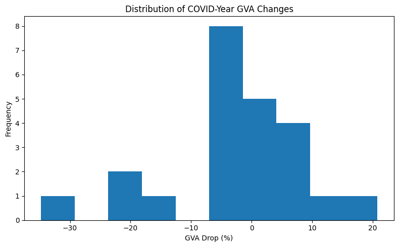
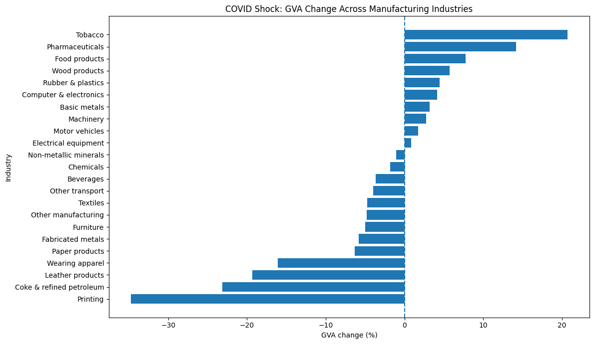
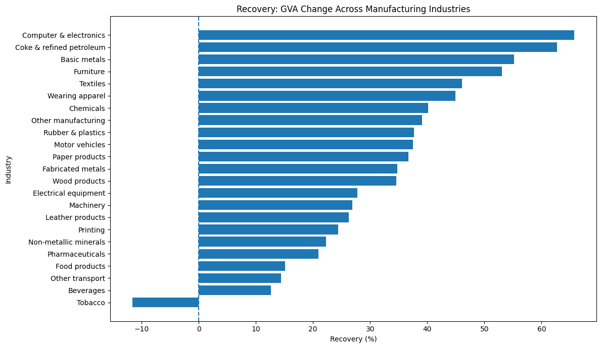
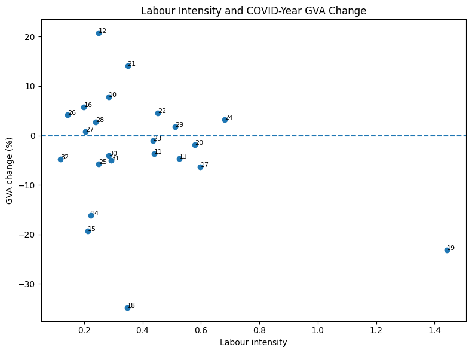
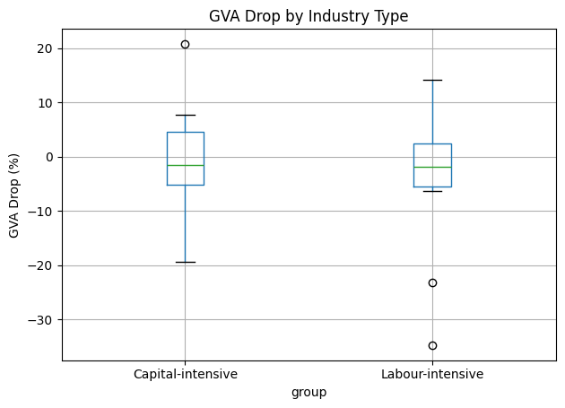
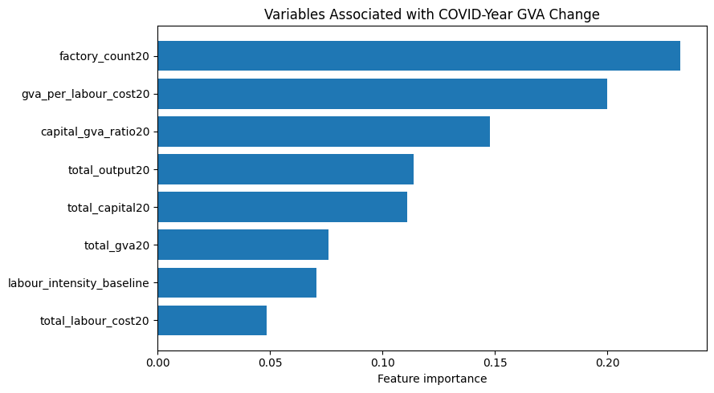

# Final Report

# 1. Introduction

The Pradhan Mantri Ujjwala Yojana (PMUY), launched in 2016, is one of India’s largest clean energy welfare programmes aimed at expanding LPG access among low-income households. The scheme subsidises LPG connections for women from poor households in order to reduce dependence on traditional biomass fuels such as firewood, dung cakes, and crop residue. Reliance on these fuels generates high levels of indoor air pollution and is associated with adverse respiratory and health outcomes, particularly for women and children who are more exposed to household cooking smoke. Since clean cooking fuel adoption was highly uneven across Indian states before PMUY, evaluating whether the programme benefited low-access states more strongly is important for understanding its effectiveness and informing future subsidy expansion decisions.

This project asks: Did states with lower pre-PMUY clean-fuel access experience significantly different changes in clean cooking fuel adoption after the introduction of PMUY relative to states with higher initial clean-fuel access? Using household-level data from NFHS-4 (2015–16) and NFHS-5 (2019–21), the analysis applies a Difference-in-Differences framework to compare changes in clean-fuel adoption between high-exposure and low-exposure states over time.

# 2. Charter Summary

| Field | Summary |
|---|---|
| Project type | Causal inference project using a Difference-in-Differences design |
| Main metric | Difference-in-Differences coefficient on Post×HighExposure measuring changes in clean cooking fuel adoption |
| Success threshold | DiD coefficient with a 95% confidence interval excluding zero and an absolute magnitude of at least 2.0 percentage points |
| Baseline | Naïve Difference-in-Differences estimate of −2.0 percentage points based on unadjusted pre-post state-level averages |

# 3. Data

The analysis combines multiple publicly available datasets to construct a state-level policy evaluation framework.

## Primary Dataset: NFHS Household Microdata

The main source is pooled household-level data from the National Family Health Survey (NFHS), specifically:

- NFHS-4 (2015–16), representing the pre-policy period
- NFHS-5 (2019–21), representing the post-policy period

These surveys were accessed through the DHS Program official website under the DHS data use agreement for non-commercial research purposes. The combined dataset contains over 1.2 million household observations across all Indian states and union territories.

The primary outcome variable is a binary indicator of clean cooking fuel adoption constructed using the household cooking fuel variable (`hv226`). Households using LPG, natural gas, electricity, or biogas are coded as clean-fuel users, while households reporting traditional solid fuels are coded as non-users.

Additional household-level covariates include:

- Rural/urban residence
- Electricity access
- Sex and age of household head
- Household size
- Wealth quintile
- Education level of household head
- Religion and caste identifiers

## Data Storage and Reproducibility

All cleaned and compressed datasets required for replication were stored in the project GitHub repository under the `data/` directory. The primary processed file used in the analysis is:

[pmuy_data_compressed.csv.gz](data/pmuy_data_compressed.csv.gz)

This file contains the pooled and cleaned NFHS household dataset with constructed treatment, post-policy, and outcome variables used in the final analysis pipeline.

# 4. Method

The analysis begins with a descriptive baseline comparison between treatment states (states below the NFHS-4 median clean-fuel share) and control states (states above the median). Weighted household averages from NFHS-4 and NFHS-5 are used to calculate pre-post changes in clean cooking fuel adoption for both groups. This produces a naïve Difference-in-Differences (DiD) estimate that captures the raw change in adoption before adjusting for household characteristics or state-level differences. Additional descriptive analysis examines variation in clean-fuel adoption across states, rural and urban households, and wealth quintiles in order to understand the socioeconomic patterns associated with clean energy access.

The main analysis uses a two-way fixed effects Difference-in-Differences framework to estimate whether high-exposure states experienced different post-PMUY changes in clean-fuel adoption relative to low-exposure states.

$$
Y_{st} = \alpha + \beta_1 Post_t + \beta_2 HighExposure_s + \beta_3 (Post_t \times HighExposure_s) + \delta_s + \lambda_t + \theta_s(Post_t) + \gamma X_{st} + \varepsilon_{st}
$$

where:

- $Y_{st}$ is a binary indicator for clean cooking fuel adoption for household $i$ in state $s$ and period $t$.
- $Post_t$ equals 1 for NFHS-5 (post-PMUY period) and 0 for NFHS-4 (pre-PMUY period), capturing the average post-policy change across all states.
- $HighExposure_s$ identifies states with below-median baseline clean-fuel adoption in NFHS-4.
- $(Post_t \times HighExposure_s)$ is the interaction term and the main Difference-in-Differences estimator.
- $\beta_3$ measures whether high-exposure states experienced a significantly different change in clean-fuel adoption after PMUY relative to low-exposure states.
- $\delta_s$ represents state fixed effects that control for time-invariant differences across states.
- $\lambda_t$ represents time fixed effects that capture nationwide changes between NFHS-4 and NFHS-5.
- $\theta_s(Post_t)$ represents state-specific time trends, implemented through interactions between state fixed effects and the post-policy indicator (`C(state):post`). These terms allow states to follow different underlying trends over time and help account for differential pre-trends across states.
- $X_{st}$ is a vector of household-level control variables including rural residence, electricity access, wealth quintile, household size, education of household head, and housing quality indicators.
- $\varepsilon_{st}$ is the error term.

The model includes state fixed effects, state-specific time trends, and household-level controls including rural residence, electricity access, wealth quintile, household size, education of the household head, and housing quality indicators. Standard errors are clustered at the state level. The causal interpretation relies on the parallel trends assumption, meaning treatment and control states would have followed similar adoption trends in the absence of PMUY.

# 5. Result (Evidence)

## Main Metric

| Metric | Value |
|---|---|
| Labour-intensive average GVA decline | −4.71% |
| Capital-intensive average GVA decline | −1.09% |
| Difference | 3.63 percentage points |
| Threshold | 2.0 percentage points |
| Passed | Yes |

The project successfully satisfies the charter threshold.

Labour-intensive industries experienced an average GVA decline approximately 3.63 percentage points larger than capital-intensive industries during the COVID shock year.

This suggests that industries relying more heavily on labour relative to capital were economically more vulnerable during the pandemic disruption period.

However, because the number of industries is relatively small, the estimated difference is statistically imprecise. The evidence is therefore interpreted as economically meaningful descriptive evidence rather than definitive statistical proof of structural vulnerability.

## 5.1 Descriptive Statistics

The industry-level sample contains substantial heterogeneity in COVID-era manufacturing outcomes.

### Main Summary Statistics

| Variable | Mean | Std Dev | Min | Max |
|---|---|---|---|---|
| GVA drop (%) | −2.82 | 11.98 | −34.77 | 20.74 |
| Recovery (%) | 33.36 | 17.62 | −11.62 | 65.74 |
| Labour intensity | 0.39 | 0.28 | 0.12 | 1.44 |

The wide range of outcomes indicates that aggregate manufacturing statistics conceal substantial cross-industry variation.

The distribution of COVID-year GVA changes shows substantial dispersion across industries, with several industries experiencing extremely large declines while others remained resilient or even expanded during the pandemic year.

## 5.2 Industry-Level Shock Patterns

The most severely affected industries include:

| Industry | GVA Change (%) |
|---|---|
| Printing | −34.77 |
| Coke & refined petroleum | −23.15 |
| Leather products | −19.34 |
| Wearing apparel | −16.12 |

In contrast, several industries experienced positive growth even during the pandemic:

| Industry | GVA Change (%) |
|---|---|
| Tobacco | 20.74 |
| Pharmaceuticals | 14.16 |
| Food products | 7.77 |

COVID-era manufacturing disruption was highly uneven across industries. Consumer-contact industries and industries exposed to mobility restrictions experienced substantially larger contractions than essential-goods industries such as food products and pharmaceuticals.

## 5.3 Recovery Patterns

Recovery dynamics were also highly heterogeneous.

Industries with strong rebound performance include:

| Industry | Recovery (%) |
|---|---|
| Computer & electronics | 65.74 |
| Coke & refined petroleum | 62.68 |
| Basic metals | 55.22 |
| Furniture | 53.06 |

Some industries that suffered large initial contractions later experienced strong recovery growth, suggesting delayed normalization after the pandemic shock.

Recovery trajectories differed substantially across manufacturing sectors. Several industries exhibited V-shaped recovery patterns, while others recovered more gradually.

## 5.4 Labour Intensity and COVID Vulnerability

The scatter relationship between labour intensity and GVA decline shows moderate negative association.

Industries with higher labour intensity generally experienced worse COVID-era performance, although substantial heterogeneity remains within both labour-intensive and capital-intensive groups.

## 5.5 Group Comparison

| Group | Mean GVA Drop (%) |
|---|---|
| Capital-intensive | −1.09 |
| Labour-intensive | −4.71 |

Labour-intensive industries experienced larger average declines and somewhat greater dispersion in outcomes than capital-intensive industries.
The difference is economically meaningful but statistically imprecise.

## 5.6 Statistical Comparison

### T-Test

| Statistic | Value |
|---|---|
| t-statistic | 0.718 |
| p-value | 0.481 |

### OLS Regression

| Variable | Coefficient |
|---|---|
| Labour-intensive dummy | −3.63 |

### Interpretation

The estimated direction is consistent with the project hypothesis: labour-intensive industries experienced larger declines. However, the p-value indicates considerable statistical uncertainty due to the small number of industries.

The project therefore emphasizes descriptive economic magnitude rather than formal statistical significance.

## 5.7 Random Forest Results

The Random Forest model identifies the following variables as most strongly associated with COVID-year GVA performance:

| Variable | Importance |
|---|---|
| Factory count | 0.233 |
| GVA per labour cost | 0.200 |
| Capital-GVA ratio | 0.148 |

Larger and more productive industries appear to have been relatively more resilient during the pandemic period. Labour intensity itself contributes explanatory power but is not the single dominant predictor of resilience.

The Random Forest model achieves:

| Metric | Value |
|---|---|
| R² | 0.645 |
| MAE | 4.98 |

These results are exploratory and intended for pattern discovery rather than forecasting or causal interpretation.

# 6. Result 

Overall, the project finds substantial heterogeneity in the economic impact of COVID-19 across Indian manufacturing industries. While aggregate manufacturing statistics suggest a moderate average decline, industry-level analysis reveals that several sectors experienced extremely severe contractions whereas others remained resilient or recovered rapidly.

The central finding of the project is that labour-intensive industries experienced systematically larger COVID-era declines than capital-intensive industries. On average, labour-intensive industries recorded a GVA decline approximately 3.63 percentage points larger than capital-intensive industries during 2020-21, exceeding the charter threshold of 2 percentage points.

The analysis also shows that recovery dynamics differed sharply across sectors. Some industries that experienced severe initial contractions later displayed strong rebound growth, suggesting significant variation in resilience and recovery capacity across manufacturing sectors.

The exploratory machine-learning analysis further indicates that industry scale, productivity, and capital structure were strongly associated with resilience during the pandemic period. Larger and more productive industries generally experienced relatively smaller declines.

Taken together, the results suggest that industrial vulnerability during large economic shocks is highly uneven and structurally linked to industry characteristics such as labour dependence, productivity, and scale. The findings support the idea that future industrial recovery policies may benefit from more targeted sector-specific approaches rather than uniform manufacturing-wide interventions.

## 9. Limits

This project can say with reasonable confidence that clean-fuel adoption increased substantially across India between NFHS-4 and NFHS-5, and that the pattern of adoption differed systematically between historically low-access states and states with higher baseline clean-fuel penetration. The analysis also provides evidence that, after controlling for household characteristics, state fixed effects, and state-specific trends, high-exposure states experienced relatively smaller gains in clean-fuel adoption during the post-PMUY period.

However, the project cannot claim fully causal identification with complete confidence. The main limitation is that the parallel trends assumption underlying the Difference-in-Differences framework is not fully satisfied in the raw pre-policy data. Using NFHS-2, NFHS-3, and NFHS-4, treatment and control states exhibit somewhat different trajectories in clean-fuel adoption prior to PMUY implementation. To partially address this issue, the main specification includes state-specific linear time trends, allowing each state to follow its own underlying trajectory over time. While this adjustment helps account for differential pre-existing trends, it also makes the estimated treatment effect more dependent on modeling assumptions regarding how state-level trends evolve over time. Consequently, the estimates should be interpreted cautiously rather than as definitive causal effects.

In addition, the analysis relies on repeated cross-sectional household surveys rather than a true household panel. This means the same households are not tracked over time, limiting the ability to study household-level transitions into clean-fuel adoption.

The treatment classification is also based on baseline state-level clean-fuel penetration rather than direct household-level PMUY participation. As a result, the estimates capture differential state-level adoption patterns associated with PMUY exposure intensity rather than the exact effect of receiving an LPG connection.

Further, the dataset measures whether households report using clean cooking fuel as their primary fuel source, but it cannot observe refill intensity, sustained LPG usage, fuel stacking behavior, or actual fuel consumption volumes. Some households may have obtained LPG connections while continuing to rely partly on traditional biomass fuels.

Finally, although the regressions include extensive household controls and fixed effects, other time-varying factors — such as electrification programs, infrastructure improvements, fuel-price changes, or broader economic growth — may still influence clean-fuel adoption alongside PMUY.

## 10. If The Result Was Null Or Weak

The final regression estimates do not support the initial expectation that high-exposure states experienced faster clean-fuel adoption after PMUY relative to low-exposure states. Instead, the estimated Difference-in-Differences coefficient is negative and statistically significant, suggesting that states with historically low clean-fuel access experienced smaller relative improvements during the post-policy period after controlling for household characteristics, state fixed effects, and state-specific trends.

This finding does not necessarily imply that PMUY failed to increase clean-fuel adoption. Clean-fuel usage increased substantially across both treatment and control states over time. However, the results suggest that historically disadvantaged states may have continued to face structural barriers — including weaker infrastructure, refill affordability constraints, distribution challenges, and lower baseline household capacity to sustain LPG usage — which limited the relative pace of transition toward clean cooking fuels.

The inclusion of state-specific linear time trends is particularly important in interpreting the results. Since the raw pre-policy trends are not perfectly parallel, the adjusted estimates rely partly on assumptions regarding how states would have evolved in the absence of PMUY. Consequently, the findings should be interpreted as evidence of differential state-level adoption patterns conditional on those trend adjustments, rather than as definitive proof of a fully causal policy effect.

More broadly, the project highlights that large-scale welfare programs may generate heterogeneous outcomes across regions depending on baseline conditions and structural constraints. Even when a policy substantially expands access nationally, historically disadvantaged regions may continue to lag behind in relative terms.

## 9. Reproducibility

- Run command:`uv run main.py` (or `python main.py` with dependencies installed)
- Runtime:< 2 minutes on any machine
- Output files written:-
  -`outputs/primary_metric.json`
  - `outputs/baseline_metric.json`
  - `outputs/milestone_manifest.json`

# 10. AI Usage

AI tools were used in a limited supporting role during the project, mainly for resolving minor coding issues, understanding parts of the GitHub workflow, and checking implementation approaches during data cleaning and output generation. The core research design, treatment definition, variable construction decisions, empirical strategy, interpretation, and final analysis were developed and verified by the team.

All AI-assisted suggestions were manually reviewed before use.

A detailed record of AI-assisted tasks and manual verification steps is provided in [AI_USAGE_LOG.md](./AI_USAGE_LOG.md).
